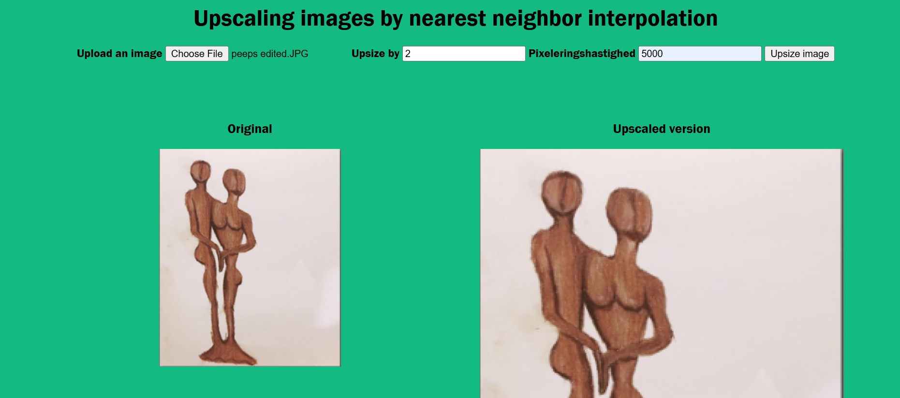

# Nearest neighbor interpolation (image upscaler)

## [Link to live version](https://buan0001.github.io/nearest-neighbor-upsizing/)

Nearest Neighbor Interpolation is an algorithm used for upscaling images. It's a rather simple way of enlarging images, but works very well in instances where smooth edges aren't necessary - ideal for Pixel Art and the like!

Made by Buster and [Lise](https://github.com/LisePetculescu)
 :)

Screenshot from running application:

How it works:

* First step is to define a scaling factor (greater than 1) - this is the number we will multiply with the original dimensions.

* We then create a new "empty" image `original size * scaling factor` larger than the original image.

* Every pixel is then repainted onto this new image through the process of finding the corresponding pixel value in the input image and copying it onto the new, larger image (the output image).

* Say we have an image with the dimensions: `100 x 100` and we want to scale it up by `2`. We start by creating an "empty image" with the dimensions `200 x 200`.

* Say we then want to figure out what the pixel value in the output image at `x = 20, y = 10` should be.

* The x-coordinate for the pixel in the input image is found by: `originalX = Math.round(outputX / scalingFactor)`

* In this instance:
  `originalX = Math.round(20 / 2) = 10`

* And the same goes for Y:
  `originalY = Math.round(10 / 2) = 5`

* Since the pixel values of the images are kept in an array, we can then find the correct input-pixel's value by finding its index:
  `indexForPixelValue = (originalY * originalImageWidth + originalX) * 4`

* Note that we have to multiply with 4 in this instance, since every pixel value takes up 4 array indices (RGBA).

* And in this instance:
  `indexForPixelValue = (5 * 100 + 10) * 4 = 2040`

* And _just like that_ we have found the first index of the pixel's value - the red R value. We can easily get the green, blue and alpha values (GBA) by looking at the next 3 indexes.

* These values are then copied on to the new image and the process is repeated until every pixel in the upscaled image has been filled out.

Inspiration found at:

- https://en.wikipedia.org/wiki/Nearest-neighbor_interpolation

- https://en.wikipedia.org/wiki/Image_scaling

- https://www.youtube.com/watch?v=ZVuRUXdIwDA
